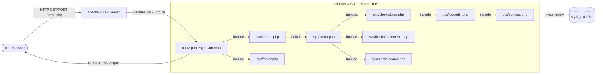

# 01 — System Architecture & Runtime Overview

> **Module**: System Architecture, Request Lifecycle, Templating, Layout & Execution Model  
> **Source Directory**: `app/v3-original_2013/`

---

## 1. Monolithic Procedural Architecture

cRentSys implements a traditional **Page Controller / Script-per-URL** architecture typical of early PHP web applications. There is no centralized router (like `index.php?route=...` or front controller); each user action maps directly to a distinct `.php` file on the filesystem.



---

## 2. Layout & Templating Pipeline

Presentation is assembled through standard PHP `include()` statements nesting header, navigation sidebar, main content area, and footer within a rigid **770px wide HTML table**.

```
+-----------------------------------------------------------------------+
|  HEADER ROW (770px x 65px) -> sys/images/head.jpg                      |
+-----------------------------------+-----------------------------------+
|  LEFT SIDEBAR (200px)             |  MAIN CONTENT PANE (570px)        |
|  sys/menu.php                     |  (Specific Page Controller Script)|
|  +-----------------------------+  |                                   |
|  | sys/blocks/login.php        |  |  e.g. rent.php, admin_car.php,    |
|  | - User info or Login Form   |  |       admin_calendar.php, etc.    |
|  +-----------------------------+  |                                   |
|  | sys/blocks/mainmenu.php     |  |                                   |
|  | - Dynamic links by $szint   |  |                                   |
|  +-----------------------------+  |                                   |
|  | sys/blocks/search.php       |  |                                   |
|  | - Quick rental filter form  |  |                                   |
|  +-----------------------------+  |                                   |
+-----------------------------------+-----------------------------------+
|  FOOTER ROW -> sys/footer.php                                         |
+-----------------------------------------------------------------------+
```

### Core Layout Components

1. **`sys/header.php`**:
   - Declares the HTML wrapper, sets the character encoding to `ISO-8859-2`, links `style.css`, and initiates the outer container table (`width="770"`).
   - Dynamically includes `sys/menu.php` in the left table cell (`<TD width="200" class="menu">`).
2. **`sys/menu.php`**:
   - Aggregates the 3 structural sidebar blocks:
     - `sys/blocks/login.php`: Displays user greetings and session links (Adatmódosítás, Foglalásaim, Kijelentkezés) when logged in, or username/password inputs when unauthenticated.
     - `sys/blocks/mainmenu.php`: Dynamic navigation tree that renders the **Adminisztrátor** link if `$loggedlevel == 9`, and the **Foglalás** link if `$loggedin == 1`.
     - `sys/blocks/search.php`: Sticky vehicle availability form with year/month/day/hour selectors.
3. **`sys/footer.php`**:
   - Closes the main content cell (`</TD>`), closes the table (`</TABLE>`), and closes `</BODY></HTML>`.

---

## 3. Database Connection & Lifecycle

Database access is established via `sys/connect.php`:

```php
<?php
  mysql_connect ("localhost", "localren", "tnerLACOL8002") or die (mysql_error());
  mysql_select_db ("localren_hu") or die (mysql_error());
?>
```

### Operational Characteristics:
- **Connection Model**: Uses non-persistent `mysql_connect()` on each HTTP request.
- **Error Handling**: Hard failure via `or die(mysql_error())`, printing raw MySQL errors and query strings directly to the client browser on connection or query failure.
- **Encoding Configuration**: Does not issue `SET NAMES utf8` or `SET NAMES latin2`; it relies entirely on the default MySQL server charset (typically `latin2` or `latin1`).

---

## 4. Session & State Management Pattern

The application completely foregoes PHP native server-side sessions (`session_start()`, `$_SESSION`) in favor of **client-side cookie state**:

```mermaid
sequenceDiagram
    autonumber
    actor Browser
    participant Login as user.php
    participant Checker as sys/loggedin.php
    participant DB as MySQL (v3_user)

    Note over Browser,Login: User logs in
    Browser->>Login: POST usernev="kovacs", pass="titok123"
    Login->>DB: SELECT usernev, pass FROM v3_user
    Login->>Browser: Set-Cookie: usernev="kovacs"<br/>Set-Cookie: pass="titok123"
    
    Note over Browser,Checker: Subsequent Page Request (e.g. rent.php)
    Browser->>Checker: GET /rent.php (Cookie: usernev="kovacs"; pass="titok123")
    Checker->>DB: SELECT uid, usernev, pass, szint FROM v3_user
    Note over Checker: Loops through all users in memory:<br/>if (row['usernev'] == $_COOKIE['usernev'] AND<br/> row['pass'] == $_COOKIE['pass'] AND row['szint'] > 0)<br/>=> $loggedin=1, $loggedlevel=row['szint'], $ulogged=row['uid']
    Checker-->>Browser: Render authenticated content
```

### State Variables Exported by `sys/loggedin.php`:
* `$loggedin` (`0` or `1`): Boolean flag indicating whether the requester is authenticated with an active account.
* `$loggedlevel` (`0`, `1`, or `9`): The authorization level from `v3_user.szint`.
* `$ulogged` (`int`): The integer user ID (`v3_user.uid`) used for foreign keys in bookings.

---

## 5. Client-Side Tooltip Architecture (`wz_tooltip.js`)

For rich administrative scheduling, cRentSys integrates the classic **Walter Zorn DHTML Tooltip Library** (`wz_tooltip.js` v5.31). 
- Dynamically attaches to `onmouseover="Tip('...')" / onmouseout="UnTip()"` attributes in HTML table cells in `admin_calendar.php` and `admin_cal2.php`.
- Allows dispatchers to hover over dates on the monthly vehicle grid to instantly inspect the reservation details (customer name, phone number, pickup/return times) without loading a new page.
