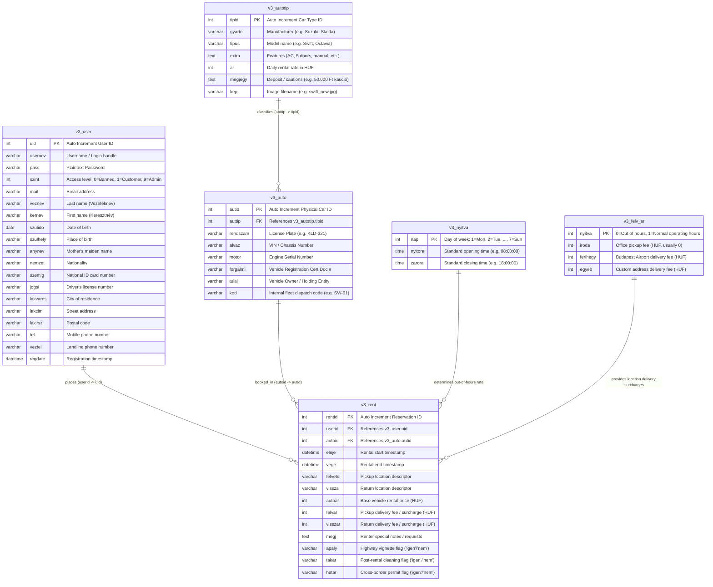

# 02 — Database Architecture & Data Models

> **Module**: Database Schema, Data Dictionaries, Entity Relationships, Indices & DDL  
> **Target Database**: MySQL 4.1 / 5.0+ (Legacy `ext/mysql`)

---

## 1. Entity-Relationship Model

cRentSys is built upon 6 relational tables designed to manage user identities, vehicle models, physical fleet units, rental bookings, operating schedules, and location delivery fees.



---

## 2. Comprehensive Data Dictionaries

### 2.1 Table: `v3_user`
Stores customer profiles, identity credentials for rental agreements, contact details, and role privileges.

| Column | Type | Nullable | Description |
| :--- | :--- | :--- | :--- |
| `uid` | `INT(11)` | NO (PK, AI) | Unique internal user identifier. |
| `usernev` | `VARCHAR(50)` | NO | Unique login name. |
| `pass` | `VARCHAR(50)` | NO | Login password (stored in plaintext). |
| `szint` | `INT(2)` | NO | Access level (`0` = Inactive/banned, `1` = Standard customer, `9` = Administrator). |
| `mail` | `VARCHAR(100)` | NO | Customer email address for booking confirmations. |
| `veznev` | `VARCHAR(50)` | NO | Hungarian family name / surname. |
| `kernev` | `VARCHAR(50)` | NO | First / given name. |
| `szulido` | `DATE` / `VARCHAR(20)` | YES | Birth date (required for rental contract). |
| `szulhely` | `VARCHAR(50)` | YES | City/town of birth. |
| `anynev` | `VARCHAR(50)` | YES | Mother's maiden name (standard Hungarian identity field). |
| `nemzet` | `VARCHAR(50)` | YES | Nationality (e.g. `Magyar`). |
| `szemig` | `VARCHAR(30)` | YES | Hungarian National Identity Card or Passport number. |
| `jogsi` | `VARCHAR(30)` | YES | Driver's license number. |
| `lakvaros` | `VARCHAR(50)` | YES | City of permanent residence. |
| `lakcim` | `VARCHAR(100)` | YES | Street, house number, apartment. |
| `lakirsz` | `VARCHAR(10)` | YES | Postal / ZIP code. |
| `tel` | `VARCHAR(30)` | NO | Primary mobile phone number. |
| `veztel` | `VARCHAR(30)` | YES | Secondary / landline phone number. |
| `regdate` | `DATETIME` | YES | Timestamp of registration. |

---

### 2.2 Table: `v3_autotip`
Defines vehicle categories, models, daily base pricing, and marketing specifications.

| Column | Type | Nullable | Description |
| :--- | :--- | :--- | :--- |
| `tipid` | `INT(11)` | NO (PK, AI) | Unique vehicle model ID. |
| `gyarto` | `VARCHAR(50)` | NO | Manufacturer / Make (e.g., "Suzuki", "Skoda"). |
| `tipus` | `VARCHAR(50)` | NO | Model name (e.g., "Swift 1.3", "Octavia Combi"). |
| `extra` | `TEXT` | YES | Feature list (e.g., "Klímás, 5 ajtós, centrálzár, elektromos ablak"). |
| `ar` | `INT(11)` | NO | Base rental price per 24-hour day in Hungarian Forints (HUF). |
| `megjegy` | `TEXT` | YES | Administrative notes / security deposit terms (e.g., "Kaució: 50.000 Ft"). |
| `kep` | `VARCHAR(100)` | YES | Image filename located in `photos/` (e.g. `swift_new.jpg`). |

---

### 2.3 Table: `v3_auto`
Tracks physical inventory in the fleet (individual vehicles with license plates and VINs).

| Column | Type | Nullable | Description |
| :--- | :--- | :--- | :--- |
| `autid` | `INT(11)` | NO (PK, AI) | Unique physical vehicle ID. |
| `auttip` | `INT(11)` | NO (FK) | Reference to `v3_autotip.tipid`. |
| `rendszam` | `VARCHAR(15)` | NO | Hungarian license plate (e.g., "JHG-412"). |
| `alvaz` | `VARCHAR(50)` | YES | Vehicle Identification Number (VIN / Alvázszám). |
| `motor` | `VARCHAR(50)` | YES | Engine serial number (Motorszám). |
| `forgalmi` | `VARCHAR(50)` | YES | Vehicle registration certificate booklet number. |
| `tulaj` | `VARCHAR(100)` | YES | Legal owner / leasing partner entity. |
| `kod` | `VARCHAR(20)` | NO | Short dispatcher code (e.g., "SW-01", "OCT-02") used on calendars. |

---

### 2.4 Table: `v3_rent`
Stores all reservation records, booked time intervals, location choices, extras, and calculated fees.

| Column | Type | Nullable | Description |
| :--- | :--- | :--- | :--- |
| `rentid` | `INT(11)` | NO (PK, AI) | Unique booking / rental record ID. |
| `userid` | `INT(11)` | NO (FK) | Reference to `v3_user.uid`. |
| `autoid` | `INT(11)` | NO (FK) | Reference to `v3_auto.autid`. |
| `eleje` | `DATETIME` | NO | Rental start datetime (`YYYY-MM-DD HH:MM:SS`). |
| `vege` | `DATETIME` | NO | Rental end datetime (`YYYY-MM-DD HH:MM:SS`). |
| `felvetel` | `VARCHAR(100)` | NO | Handover/pickup location description. |
| `vissza` | `VARCHAR(100)` | NO | Return location description. |
| `autoar` | `INT(11)` | NO | Net vehicle base rental price in HUF. |
| `felvar` | `INT(11)` | NO | Pickup delivery / out-of-hours fee in HUF. |
| `visszar` | `INT(11)` | NO | Return delivery / out-of-hours fee in HUF. |
| `megj` | `TEXT` | YES | Customer notes, requests, flight numbers. |
| `apaly` | `VARCHAR(10)` | YES | Hungarian motorway vignette option (`igen` / `nem`). |
| `takar` | `VARCHAR(10)` | YES | Post-rental cleaning service option (`igen` / `nem`). |
| `hatar` | `VARCHAR(10)` | YES | Cross-border travel authorization (`igen` / `nem`). |

---

### 2.5 Table: `v3_nyitva`
Defines weekly standard operating hours per day of week to calculate out-of-hours surcharges.

| Column | Type | Nullable | Description |
| :--- | :--- | :--- | :--- |
| `nap` | `INT(2)` | NO (PK) | Day of week (`1` = Monday, `2` = Tuesday, ..., `7` = Sunday). |
| `nyitora` | `TIME` | NO | Opening hour (`HH:MM:SS`, e.g., `08:00:00`). |
| `zarora` | `TIME` | NO | Closing hour (`HH:MM:SS`, e.g., `18:00:00`). |

---

### 2.6 Table: `v3_felv_ar`
Location fee matrix storing delivery surcharges for normal vs. out-of-hours pickup/return.

| Column | Type | Nullable | Description |
| :--- | :--- | :--- | :--- |
| `nyitva` | `INT(2)` | NO (PK) | `1` = Regular business hours, `0` = Out of business hours / weekends. |
| `iroda` | `INT(11)` | NO | Fee for central office handover (HUF, default: `0`). |
| `ferihegy` | `INT(11)` | NO | Fee for Budapest Liszt Ferenc Airport (Ferihegy) delivery (HUF). |
| `egyeb` | `INT(11)` | NO | Fee for custom address within Budapest (HUF). |

---

## 3. Standalone MySQL DDL (`schema.sql`)

```sql
-- cRentSys (LocalRent v3) Relational Schema DDL
-- Compatible with MySQL 5.x / 8.x and MariaDB

CREATE TABLE IF NOT EXISTS `v3_user` (
  `uid` int(11) NOT NULL AUTO_INCREMENT,
  `usernev` varchar(50) NOT NULL,
  `pass` varchar(50) NOT NULL,
  `szint` int(2) NOT NULL DEFAULT '1',
  `mail` varchar(100) NOT NULL,
  `veznev` varchar(50) NOT NULL,
  `kernev` varchar(50) NOT NULL,
  `szulido` varchar(20) DEFAULT NULL,
  `szulhely` varchar(50) DEFAULT NULL,
  `anynev` varchar(50) DEFAULT NULL,
  `nemzet` varchar(50) DEFAULT 'Magyar',
  `szemig` varchar(30) DEFAULT NULL,
  `jogsi` varchar(30) DEFAULT NULL,
  `lakvaros` varchar(50) DEFAULT NULL,
  `lakcim` varchar(100) DEFAULT NULL,
  `lakirsz` varchar(10) DEFAULT NULL,
  `tel` varchar(30) NOT NULL,
  `veztel` varchar(30) DEFAULT NULL,
  `regdate` datetime DEFAULT NULL,
  PRIMARY KEY (`uid`),
  KEY `idx_user_login` (`usernev`, `pass`)
) ENGINE=MyISAM DEFAULT CHARSET=latin2;

CREATE TABLE IF NOT EXISTS `v3_autotip` (
  `tipid` int(11) NOT NULL AUTO_INCREMENT,
  `gyarto` varchar(50) NOT NULL,
  `tipus` varchar(50) NOT NULL,
  `extra` text,
  `ar` int(11) NOT NULL,
  `megjegy` text,
  `kep` varchar(100) DEFAULT NULL,
  PRIMARY KEY (`tipid`)
) ENGINE=MyISAM DEFAULT CHARSET=latin2;

CREATE TABLE IF NOT EXISTS `v3_auto` (
  `autid` int(11) NOT NULL AUTO_INCREMENT,
  `auttip` int(11) NOT NULL,
  `rendszam` varchar(15) NOT NULL,
  `alvaz` varchar(50) DEFAULT NULL,
  `motor` varchar(50) DEFAULT NULL,
  `forgalmi` varchar(50) DEFAULT NULL,
  `tulaj` varchar(100) DEFAULT NULL,
  `kod` varchar(20) NOT NULL,
  PRIMARY KEY (`autid`),
  KEY `idx_auto_auttip` (`auttip`)
) ENGINE=MyISAM DEFAULT CHARSET=latin2;

CREATE TABLE IF NOT EXISTS `v3_rent` (
  `rentid` int(11) NOT NULL AUTO_INCREMENT,
  `userid` int(11) NOT NULL,
  `autoid` int(11) NOT NULL,
  `eleje` datetime NOT NULL,
  `vege` datetime NOT NULL,
  `felvetel` varchar(100) NOT NULL,
  `vissza` varchar(100) NOT NULL,
  `autoar` int(11) NOT NULL,
  `felvar` int(11) NOT NULL DEFAULT '0',
  `visszar` int(11) NOT NULL DEFAULT '0',
  `megj` text,
  `apaly` varchar(10) DEFAULT 'nem',
  `takar` varchar(10) DEFAULT 'nem',
  `hatar` varchar(10) DEFAULT 'nem',
  PRIMARY KEY (`rentid`),
  KEY `idx_rent_dates` (`autoid`, `eleje`, `vege`),
  KEY `idx_rent_user` (`userid`)
) ENGINE=MyISAM DEFAULT CHARSET=latin2;

CREATE TABLE IF NOT EXISTS `v3_nyitva` (
  `nap` int(2) NOT NULL,
  `nyitora` time NOT NULL,
  `zarora` time NOT NULL,
  PRIMARY KEY (`nap`)
) ENGINE=MyISAM DEFAULT CHARSET=latin2;

CREATE TABLE IF NOT EXISTS `v3_felv_ar` (
  `nyitva` int(2) NOT NULL,
  `iroda` int(11) NOT NULL DEFAULT '0',
  `ferihegy` int(11) NOT NULL DEFAULT '0',
  `egyeb` int(11) NOT NULL DEFAULT '0',
  PRIMARY KEY (`nyitva`)
) ENGINE=MyISAM DEFAULT CHARSET=latin2;

-- Initial Seed Data
INSERT INTO `v3_nyitva` (`nap`, `nyitora`, `zarora`) VALUES
(1, '08:00:00', '18:00:00'),
(2, '08:00:00', '18:00:00'),
(3, '08:00:00', '18:00:00'),
(4, '08:00:00', '18:00:00'),
(5, '08:00:00', '18:00:00'),
(6, '08:00:00', '14:00:00'),
(7, '08:00:00', '12:00:00');

INSERT INTO `v3_felv_ar` (`nyitva`, `iroda`, `ferihegy`, `egyeb`) VALUES
(1, 0, 3000, 2000),
(0, 2000, 5000, 4000);
```
