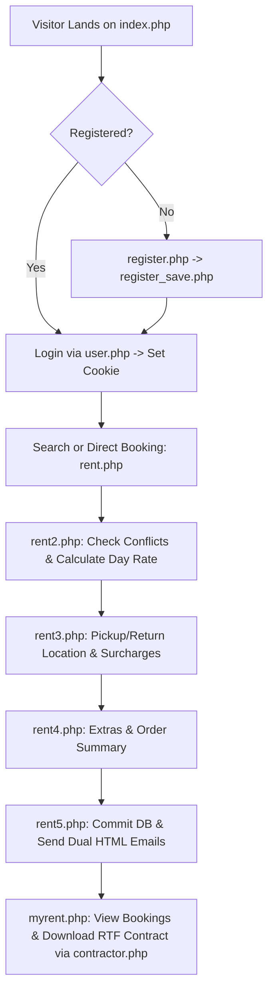

# 03 — Customer Workflows & Booking Funnel

> **Module**: Registration, Authentication, Vehicle Search Engine, 5-Step Booking Wizard, Out-of-Hours Calculation, Contract Generation  
> **Source Scripts**: `rent.php`, `rent2.php`, `rent3.php`, `rent4.php`, `rent5.php`, `search.php`, `contractor.php`, `myrent.php`

---

## 1. End-to-End Customer Journey

The customer interaction model follows a guided pipeline:



---

## 2. Step-by-Step Booking Pipeline Specification

### Step 1: Period Selection (`rent.php`)
- **Inputs**: Rental start date/time (`kev`, `kho`, `kna`, `kor`, `kpe`) and end date/time (`vev`, `vho`, `vna`, `vor`, `vpe`).
- **Validation**: Requires `$loggedin == 1`. Automatically populates current date dropdowns.
- **Output Action**: Submits via `POST` to `rent2.php`.

---

### Step 2: Conflict Detection & Daily Rate Engine (`rent2.php`)
1. **Timestamp Conversion**:
   $$t_{	ext{start}} = 	ext{mktime}(	ext{kor}, 	ext{kpe}, 0, 	ext{kho}, 	ext{kna}, 	ext{kev})$$
   $$t_{	ext{end}} = 	ext{mktime}(	ext{vor}, 	ext{vpe}, 0, 	ext{vho}, 	ext{vna}, 	ext{vev})$$
2. **Duration & Day Calculation**:
   $$\Delta t = t_{	ext{end}} - t_{	ext{start}} - 1$$
   $$	ext{Rental Days} = \lfloor rac{\Delta t}{86400} 
floor + 1$$
3. **Availability Overlap SQL Algorithm**:
   For every physical vehicle in the fleet (`v3_auto`), queries `v3_rent` for time collisions:
   ```sql
   SELECT autoid, eleje, vege 
   FROM v3_rent 
   WHERE autoid = '$autoch' 
     AND (
       (eleje <= '$kezdido' AND vege >= '$kezdido') OR 
       (eleje <= '$vegeido' AND vege >= '$vegeido') OR 
       (eleje >= '$kezdido' AND vege <= '$vegeido')
     )
   ```
   If no rows match, the vehicle is marked **Available** and displayed with thumbnail, features, and computed price ($	ext{Days} 	imes 	ext{v3\_autotip.ar}$).

---

### Step 3: Location Selection & Out-of-Hours Surcharges (`rent3.php`)
1. **Day of Week Resolution**: Resolves pickup day ($w_{	ext{start}}$) and return day ($w_{	ext{end}}$) using `date("w")` (converted to $1=	ext{Mon} \dots 7=	ext{Sun}$).
2. **Operating Hours Inspection**: Queries `v3_nyitva` for the opening and closing hours of those days.
3. **Out-of-Hours Boolean Evaluation**:
   $$	ext{is\_out\_of\_hours} = (t_{	ext{pickup\_time}} < 	ext{nyitora}) \lor (t_{	ext{pickup\_time}} > 	ext{zarora})$$
4. **Dynamic Fee Lookup**: Queries `v3_felv_ar` with `nyitva = 1` (normal hours) or `nyitva = 0` (out of hours) for:
   - Central Office (`iroda`)
   - Budapest Ferihegy Airport (`ferihegy`)
   - Custom Address / Other (`egyeb`)

---

### Step 4: Optional Extras & Order Review (`rent4.php`)
Computes the subtotal and presents optional checkbox add-ons:
- **Highway Vignette (`apaly`)**: National motorway electronic toll authorization.
- **Cross-Border Authorization (`hatar`)**: Permission to drive into neighboring European countries.
- **Post-Rental Cleaning (`takar`)**: Optional cleaning service (+2,500 HUF).
- **GPS Navigation Device (`gps`)**: Portable satellite navigation (+500 HUF/day).

---

### Step 5: Persistence & Dual Transactional Emails (`rent5.php`)
1. **Database Insertion**: Writes the reservation record to `v3_rent`:
   ```sql
   INSERT INTO v3_rent (
     userid, autoid, eleje, vege, felvetel, vissza, 
     autoar, felvar, visszar, megj, apaly, takar, hatar
   ) VALUES (
     '$ulogged', '$auto', '$kezdtelj', '$vegetelj', '$hely', '$vhely', 
     '$autoar', '$felvar', '$viszar', '$megj', '$apaly', '$takar', '$hatar'
   );
   ```
2. **Dual Email Notification via `mail()`**:
   - **Customer Confirmation Email**: Sent to `$user['mail']` with full HTML booking summary, itemized prices, required original identification documents (for Hungarian individuals, foreign nationals, or legal business entities), and company contact info.
   - **Dispatcher Notification Email**: Sent to `ugyfel@localrent.hu` with immediate operational parameters (vehicle code, renter name, pickup/dropoff points, GPS request).

---

## 3. Dynamic RTF Contract Generator (`contractor.php`)

cRentSys includes a native **Rich Text Format (RTF)** contract generator that dynamically outputs a downloadable Microsoft Word/WordPad compatible agreement (`szerzodes.rtf`).

### Data Elements Bound into RTF Stream:
- **Lessor / Owner (`tulaj`)**: Extracted from `v3_auto.tulaj`.
- **Renter Personal Details**: Full name, address, phone number, birth place/date, mother's maiden name, ID/Passport number, Driver's License number.
- **Vehicle Technical Identifiers**: Make, Model, License Plate (`rendszam`), VIN (`alvaz`), Engine # (`motor`), Registration Doc # (`forgalmi`).
- **Insurance Terms**: Explicitly states mandatory KGFB and CASCO insurance with a **10% (minimum 100,000 HUF)** deductible.
- **Financial Calculation Line**: Itemizes rental days, daily rate, delivery fees, Net subtotal, and Historic Gross total (`/5*6` for 20% VAT).
- **Formal Signatures**: Dual signature underlines for Lessor (*Bérbeadó*) and Renter (*Bérlő*).
