# 04 — Admin Backoffice & Operations Manual

> **Module**: Fleet Inventory, Vehicle Model Catalog, Dispatch Calendars, Rental Modification, Customer CRM  
> **Source Scripts**: `admin*.php`  
> **Access Requirement**: `v3_user.szint == 9`

---

## 1. Backoffice Portal Hub (`admin.php`)

All administrative functions are gated behind `$loggedlevel == 9`. The central hub provides direct access to 6 operational subsystems:

```mermaid
graph TD
    AdminHub[admin.php Dashboard] --> Fleet[Fleet & Model Management]
    AdminHub --> Calendar[Dispatch & Reservation Calendars]
    AdminHub --> Financial[Income & Revenue Reports]
    AdminHub --> CRM[Customer & User Administration]
    AdminHub --> Config[Operating Hours & Fee Setup]

    Fleet --> A1[admin_car.php: Vehicle & Model List]
    Fleet --> A2[admin_cartypnew.php: Add Car Model]
    Fleet --> A3[admin_carnew.php: Add Physical Car]

    Calendar --> B1[admin_calendar.php: Monthly Grid Matrix]
    Calendar --> B2[admin_cal2.php: Alt Matrix View]
    Calendar --> B3[admin_calday.php: Daily Schedule]
    Calendar --> B4[admin_caldetails.php: Vehicle Timeline]

    Financial --> C1[admin_allincome.php: Monthly Revenue Audit]
    Financial --> C2[admin_carincome.php: Single Vehicle ROI]

    CRM --> D1[admin_customer.php: Customer CRM Search]
    CRM --> D2[admin_user.php: Account & Level Manager]

    Config --> E1[admin_open.php: Weekly Hours Config]
    Config --> E2[admin_pricesave.php: Location Fee Matrix]
```

---

## 2. Fleet & Model Management Subsystem

### 2.1 Vehicle Model Class Catalog (`v3_autotip`)
- **`admin_car.php`**: Renders all registered vehicle classes grouped by price, showing manufacturer, model, daily rate, features, deposit notes, and attached physical cars.
- **`admin_cartypnew.php` / `admin_cartypnewsave.php`**: Form to define a new vehicle category (`gyarto`, `tipus`, `extra`, `ar`, `megjegy`, `kep`).
- **`admin_cartypmod.php` / `admin_cartypmodsave.php`**: Form to update category details and view all attached physical units.
- **`admin_cartypdel.php` / `admin_cartypdel2.php`**: Deletes a vehicle class and cascades the deletion to all physical cars referencing that `tipid`.

### 2.2 Physical Fleet Inventory (`v3_auto`)
- **`admin_carnew.php` / `admin_carnewsave.php`**: Registers a physical automobile assigned to a model class (`auttip`). Captures license plate (`rendszam`), chassis/VIN (`alvaz`), engine number (`motor`), registration cert (`forgalmi`), owner/lessor (`tulaj`), and dispatcher code (`kod`).
- **`admin_carmod.php` / `admin_carmodsave.php`**: Updates technical registration parameters of an existing vehicle.
- **`admin_cardel.php` / `admin_cardel2.php`**: Removes a single physical car from inventory.

---

## 3. Visual Dispatch & Reservation Calendars

cRentSys provides four specialized scheduling visualizers:

### 3.1 The Monthly Grid Matrix (`admin_calendar.php` & `admin_cal2.php`)
- **Grid Layout**:
  - **Rows (Y-axis)**: Fleet vehicles ordered by daily price, displayed with internal code (`SW-01`), manufacturer, and license plate.
  - **Columns (X-axis)**: Days of selected month ($1 \dots 31$).
- **Visual State Indicators**:
  - **Free / Unbooked Day**: White background with thin borders.
  - **Booked Day**: Highlighted background with interactive hover tooltip powered by `wz_tooltip.js`.
- **Tooltip Content**:
  - On mouseover, triggers `Tip(...)` rendering the customer's full name (`veznev`, `kernev`), contact phone numbers (`tel`, `veztel`), pickup time, and return time.

### 3.2 Daily Schedule Overview (`admin_calday.php` & `admin_caldaydet.php`)
- Shows a quick bird's-eye view of fleet occupancy for a specific selected calendar day.
- `admin_caldaydet.php` lists all vehicle handovers and returns occurring on that date with contact numbers.

### 3.3 Single Vehicle Timeline (`admin_caldetails.php`)
- Chronological list of all reservations for a specific vehicle.
- Provides direct links to **Edit Booking** (`admin_rentedit.php`) and **Cancel Booking** (`admin_rentdel.php`).

---

## 4. Reservation Modification & Cancellation

- **`admin_rentedit.php` / `admin_rentedsave.php`**:
  Allows dispatchers to adjust vehicle assignment, reschedule start/end datetimes, update pickup/dropoff points, and manually override `autoar`, `felvar`, or `visszar`.
- **`admin_rentdel.php` / `admin_rentdel2.php`**:
  Two-step confirmation script to permanently delete a booking record from `v3_rent`.

---

## 5. Customer Relationship Management (CRM) & User Access

- **`admin_customer.php` & `admin_customsearch.php`**:
  Search engine to look up customers by name or email. Displays full dossier with address, ID numbers, phone numbers, and complete lifetime booking history.
- **`admin_user.php` & `admin_userinfo.php`**:
  Lists all user accounts in `v3_user`.
- **`admin_usermod.php`**:
  Enables administrative elevation or revoking of account access levels:
  - `0`: Inactive / Deactivated
  - `1`: Standard Verified Renter
  - `9`: Super Administrator
