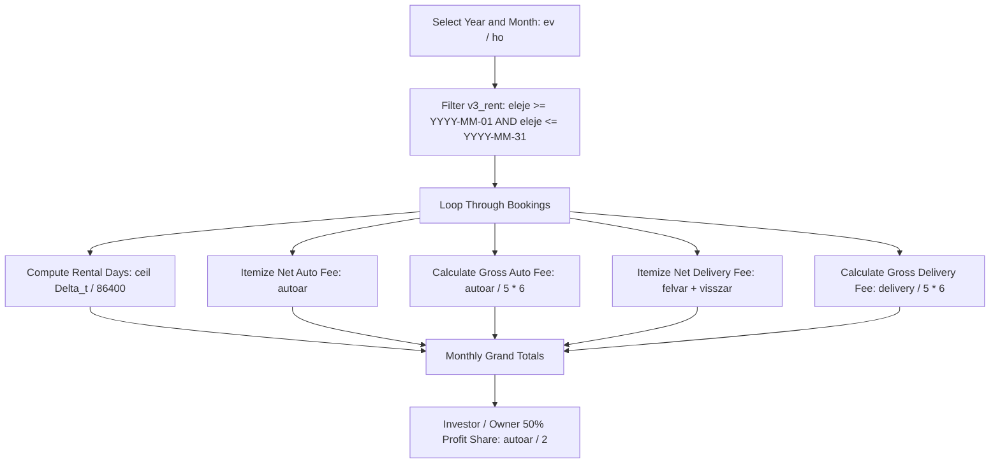

# 05 — Financial Reporting & Business Rules

> **Module**: Revenue Engine, Historic VAT (ÁFA) Calculations, Investor Share Split, Pricing Matrices  
> **Source Scripts**: `admin_allincome.php`, `admin_carincome.php`, `admin_open.php`, `admin_pricesave.php`

---

## 1. Financial Revenue Calculation Engine

cRentSys includes dedicated monthly financial auditing scripts that calculate rental turnover, delivery surcharges, and contractor revenue splits.

### 1.1 Fleet-Wide Revenue Audit (`admin_allincome.php`)



### 1.2 Tax (ÁFA) & Historic VAT Formula

The codebase incorporates the historic Hungarian **20% Value-Added Tax (ÁFA)** formula:

$$	ext{Gross Total} = 	ext{Net Total} 	imes 1.20 = 	ext{Net Total} 	imes rac{6}{5}$$

In the source code, this is calculated as:
```php
$auto_brutto = ($row['autoar'] / 5 * 6);
$kiszall_brutto = (($row['felvar'] + $row['visszar']) / 5 * 6);
$osszes_brutto = (($row['felvar'] + $row['visszar'] + $row['autoar']) / 5 * 6);
```

> [!NOTE]
> In contemporary Hungary, standard VAT (ÁFA) is 27% (multiplier $	imes 1.27$). Any modernization must make the VAT rate a configurable parameter rather than a hardcoded fractional multiplier.

---

## 2. Fleet Investor Revenue-Share Model (50% Split)

cRentSys was designed to accommodate leased or third-party investor-owned fleet vehicles. In `admin_allincome.php`, the system computes the 50% net and gross revenue share attributable to vehicle owners:

$$	ext{Owner Net Share} = rac{\sum 	ext{autoar}}{2}$$
$$	ext{Owner Gross Share} = rac{\sum 	ext{autoar}}{5} 	imes 3 \quad (= 	ext{Net Share} 	imes 1.20)$$

Delivery fees (`felvar` and `visszar`) are excluded from the investor share and retained 100% by the rental operator to cover logistical expenses.

---

## 3. Vehicle ROI & Single Car Financials (`admin_carincome.php`)

Provides monthly performance metrics for an individual vehicle (`carid`):
- Total days booked in the month.
- Utilization percentage: $rac{	ext{Total Booked Days}}{	ext{Days in Month}} 	imes 100\%$.
- Total revenue generated by the specific vehicle.

---

## 4. Location Delivery & Out-of-Hours Fee Matrix

Delivery fees are configured in `admin_pricesave.php` and persisted in `v3_felv_ar`:

| Handover Location | Normal Business Hours (`nyitva=1`) | Out-of-Hours / Weekends (`nyitva=0`) |
| :--- | :--- | :--- |
| **Central Office (`iroda`)** | 0 HUF | 2,000 HUF (or configured out-of-hours rate) |
| **Budapest Airport (`ferihegy`)** | 3,000 HUF | 5,000 HUF |
| **Custom Address (`egyeb`)** | 2,000 HUF | 4,000 HUF |

### Additional Fixed-Rate Extras:
- **Post-Rental Cleaning (`takar`)**: 2,500 HUF flat fee.
- **GPS Navigation Rental (`gps`)**: 500 HUF per day.
- **Accessories (Baby seat, roof rack, ski carrier)**: 1,000 HUF / day / item (as stated in email notices).
