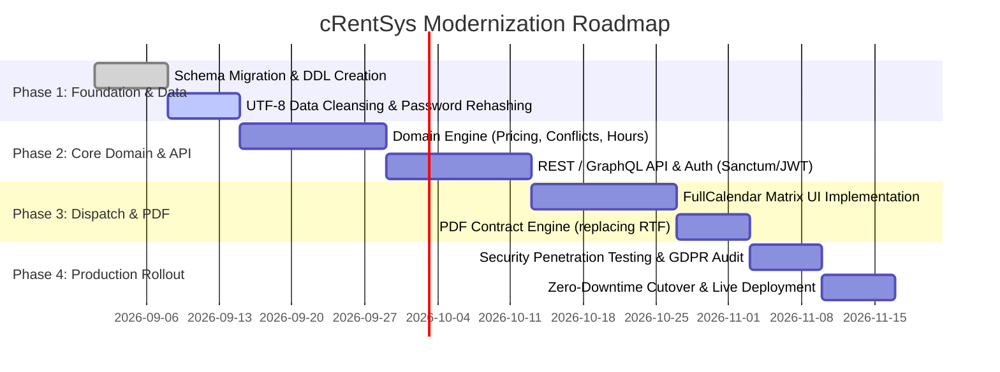

# 07 — Modernization & Migration Architecture Guide

> **Module**: Target Architecture Blueprint, Refactoring Roadmap, Data Migration & API Design  
> **Objective**: Comprehensive guide to re-engineering cRentSys into a modern, secure, high-performance web platform.

---

## 1. Recommended Modern Target Architecture

```mermaid
graph TD
    subgraph Client Tier [Modern Responsive Frontend]
        PWA["Next.js / Nuxt 3 / React SPA"]
        CalendarUI["FullCalendar / Timeline Schedule"]
        ResponsiveTheme["TailwindCSS / Mobile First"]
    end

    subgraph API Gateway & Security
        HTTPS["TLS 1.3 / HTTPS"]
        RateLimit["Rate Limiting & WAF"]
        AuthShield["JWT / OAuth2 / Argon2id Passwords"]
    end

    subgraph Core Application Backend [Laravel 11 / Symfony 7 / Node.js]
        BookingService["Booking & Pricing Domain Engine"]
        FleetService["Fleet & Inventory Management"]
        FinanceService["Invoicing & Tax (ÁFA) Engine"]
        MailService["Transactional Mail (Mailgun / SES)"]
        PDFService["PDF Contract Generator (DomPDF / Typst)"]
    end

    subgraph Persistence & Infrastructure
        RDBMS[(PostgreSQL 16 / MySQL 8.0 utf8mb4)]
        RedisCache[(Redis: Sessions & Cache)]
        ObjectStore[(S3 / GCS Fleet Image Buckets)]
    end

    PWA --> HTTPS --> HTTPS --> Core Application Backend
    CalendarUI --> HTTPS
    Core Application Backend --> RDBMS
    Core Application Backend --> RedisCache
    Core Application Backend --> ObjectStore
    Core Application Backend --> MailService
    Core Application Backend --> PDFService
```

---

## 2. Phased Re-Engineering Roadmap



---

## 3. Data Migration & Password Rehashing Strategy

### 3.1 Plaintext to Argon2id / Bcrypt Seamless Transition
To seamlessly migrate users without forcing mass password resets:
1. Store a flag `password_migrated = FALSE` in the new user schema.
2. When a legacy user submits their password on login:
   - If `password_migrated == FALSE` and `plaintext_password == input_password`:
     - Re-hash the password with `password_hash($input, PASSWORD_ARGON2ID)`.
     - Update the database record and set `password_migrated = TRUE`.
   - If `password_migrated == TRUE`, perform standard `password_verify()`.

### 3.2 ISO-8859-2 to UTF-8 Migration Script (Python Example)
```python
import pymysql

# Connect to legacy and new databases
source_db = pymysql.connect(host='localhost', user='root', password='', db='localren_hu', charset='latin2')
target_db = pymysql.connect(host='localhost', user='root', password='', db='crentsys_v4', charset='utf8mb4')

with source_db.cursor() as src, target_db.cursor() as tgt:
    src.execute("SELECT * FROM v3_user")
    for row in src.fetchall():
        # Cleanly convert strings to UTF-8
        tgt.execute("""
            INSERT INTO users (id, username, email, first_name, last_name, phone, created_at)
            VALUES (%s, %s, %s, %s, %s, %s, %s)
        """, (row['uid'], row['usernev'], row['mail'], row['kernev'], row['veznev'], row['tel'], row['regdate']))
    target_db.commit()
```

---

## 4. RESTful API Blueprint

| Method | Endpoint | Description | Auth Level |
| :--- | :--- | :--- | :--- |
| `POST` | `/api/v1/auth/login` | Authenticate and obtain Bearer JWT / Sanctum token. | Public |
| `POST` | `/api/v1/auth/register` | Register new customer account. | Public |
| `GET` | `/api/v1/vehicles/available` | Query available vehicles for given start/end timestamps. | Public / Customer |
| `POST` | `/api/v1/bookings/calculate` | Compute itemized rental quotation with location fees and extras. | Public / Customer |
| `POST` | `/api/v1/bookings` | Commit new booking and trigger confirmation emails. | Customer (`szint >= 1`) |
| `GET` | `/api/v1/bookings/my` | Retrieve booking history for authenticated customer. | Customer (`szint >= 1`) |
| `GET` | `/api/v1/bookings/{id}/contract.pdf` | Download signed PDF rental agreement. | Customer / Admin |
| `GET` | `/api/v1/admin/calendar/matrix` | Monthly fleet reservation matrix data for FullCalendar. | Admin (`szint == 9`) |
| `GET` | `/api/v1/admin/reports/revenue` | Aggregate financial and investor profit-share breakdown. | Admin (`szint == 9`) |
