# cRentSys (LocalRent v3) — Technical Documentation & Architecture Reference

> **System**: cRentSys / LocalRent On-Line Foglalási Rendszer  
> **Source Version**: `v3-original_2013` (Original Production Baseline ~2008–2013)  
> **Target Scope**: Reverse-engineered system specifications, architecture, data models, workflows, security audit, and modernization roadmap.

---

## 1. Executive Summary

**cRentSys** is a monolithic web-based car rental booking and fleet management system built for **LocalRent** (operated by *EURO Brill Kft.* in Budapest, Hungary). Developed during the PHP 4 / PHP 5.2–5.3 era, the application provides an end-to-end customer reservation funnel, automated dual confirmation email notifications, an interactive monthly reservation matrix calendar for dispatchers, vehicle fleet CRUD, dynamic RTF contract generation, and financial revenue reporting.

```mermaid
graph TD
    subgraph Public & Customer Portal
        Index["Home & Instructions<br/>(index.php)"]
        Search["Availability Search<br/>(search.php)"]
        Auth["Auth & Profile<br/>(register.php, user.php, myrent.php)"]
        RentWizard["5-Step Booking Wizard<br/>(rent.php -> rent5.php)"]
        ContractGen["RTF Contract Generator<br/>(contractor.php)"]
    end

    subgraph Admin Backoffice [Level 9 Administrator]
        AdminHub["Admin Dashboard (admin.php)"]
        FleetMgmt["Vehicle & Model CRUD<br/>(admin_car*, admin_cartyp*)"]
        Calendar["Interactive Matrix Calendars<br/>(admin_calendar.php, admin_cal2.php)"]
        Finance["Revenue & Investor Reports<br/>(admin_allincome.php, admin_carincome.php)"]
        CRM["Customer Dossiers & Access Control<br/>(admin_customer.php, admin_user.php)"]
        Config["Hours & Delivery Pricing<br/>(admin_open.php, admin_pricesave.php)"]
    end

    subgraph Data Layer [MySQL Database]
        v3_user["v3_user (Customers & Admins)"]
        v3_autotip["v3_autotip (Car Classes/Rates)"]
        v3_auto["v3_auto (Physical Fleet Vehicles)"]
        v3_rent["v3_rent (Rental Bookings)"]
        v3_nyitva["v3_nyitva (Operating Hours Schedule)"]
        v3_felv_ar["v3_felv_ar (Location Delivery Fees)"]
    end

    Auth --> v3_user
    Search --> v3_auto & v3_autotip & v3_rent
    RentWizard --> v3_rent & v3_nyitva & v3_felv_ar
    ContractGen --> v3_rent & v3_auto & v3_user
    FleetMgmt --> v3_auto & v3_autotip
    Calendar --> v3_rent & v3_auto
    Finance --> v3_rent
    CRM --> v3_user
    Config --> v3_nyitva & v3_felv_ar
```



---

## 2. Documentation Suite Navigation

This comprehensive technical documentation is structured into the following modules:

| Document | Topic | Description |
| :--- | :--- | :--- |
| **[01 - Architecture Overview](01-architecture-overview.md)** | System Design & Runtime | Request lifecycle, procedural monolith patterns, layout engine, templating, and session-state management. |
| **[02 - Database & Data Models](02-database-and-data-models.md)** | Data Layer & Schema | Complete ER diagrams, table dictionaries, primary/foreign keys, and full SQL DDL specifications. |
| **[03 - Customer Workflows & Booking Funnel](03-customer-workflows-and-booking-funnel.md)** | Customer Engine | Registration, login, overlap availability search, 5-step rental pipeline, out-of-hours calculation, and RTF contract generation. |
| **[04 - Admin Backoffice & Operations](04-admin-backoffice-and-operations.md)** | Dispatch & Fleet CRM | Fleet CRUD, visual reservation matrix calendars (`wz_tooltip`), booking modification, and user permission elevation. |
| **[05 - Financial Reporting & Business Rules](05-financial-reporting-and-business-rules.md)** | Revenue & Pricing | Revenue calculation algorithms, 20% historic VAT breakdown, 50% contractor/investor profit split, and delivery fee matrix. |
| **[06 - Security & Technical Debt Audit](06-security-and-technical-debt-audit.md)** | Vulnerabilities & Risk | In-depth security analysis (SQLi, plaintext auth, cookie forgery, PII leakage) and runtime obsolescence (`ext/mysql`, ISO-8859-2). |
| **[07 - Modernization & Migration Guide](07-modernization-and-migration-guide.md)** | Re-Engineering Blueprint | Target architecture (Laravel / Node.js / PostgreSQL), schema migration plan, UTF-8 migration, and REST API design. |
| **[08 - Appendices & File Reference](08-appendices-and-file-reference.md)** | Catalog & Glossary | Hungarian-English domain glossary, complete 59-file catalog with line counts and responsibilities, and standalone `schema.sql`. |

---

## 3. Technology Stack Snapshot

```
Runtime:          PHP 4.x / PHP 5.2–5.3 (Procedural script-per-page)
Database:         MySQL 4.1 / 5.0 (via ext/mysql extension)
Character Set:    ISO-8859-2 (Latin-2 Central European)
Layout / CSS:     HTML 4.01 Tables + style.css
JavaScript:       wz_tooltip.js (Walter Zorn DHTML Tooltip Library v5.31)
Authentication:   Client-side Cookie based ($_COOKIE['usernev'], $_COOKIE['pass'])
Communication:    PHP mail() with HTML multipart MIME formatting
Document Engine:  Raw RTF (Rich Text Format) stream generator
```

---

## 4. Reading Paths by Role

* **Software Engineers / Refactoring Teams**: Start with [01 - Architecture Overview](01-architecture-overview.md) and [02 - Database & Data Models](02-database-and-data-models.md), then review [07 - Modernization & Migration Guide](07-modernization-and-migration-guide.md).
* **Security & QA Auditors**: Read [06 - Security & Technical Debt Audit](06-security-and-technical-debt-audit.md) for vulnerability proof-of-concepts and risk matrices.
* **Product & Domain Analysts**: Review [03 - Customer Workflows](03-customer-workflows-and-booking-funnel.md), [05 - Financial Reporting](05-financial-reporting-and-business-rules.md), and the Hungarian-English glossary in [08 - Appendices](08-appendices-and-file-reference.md).
