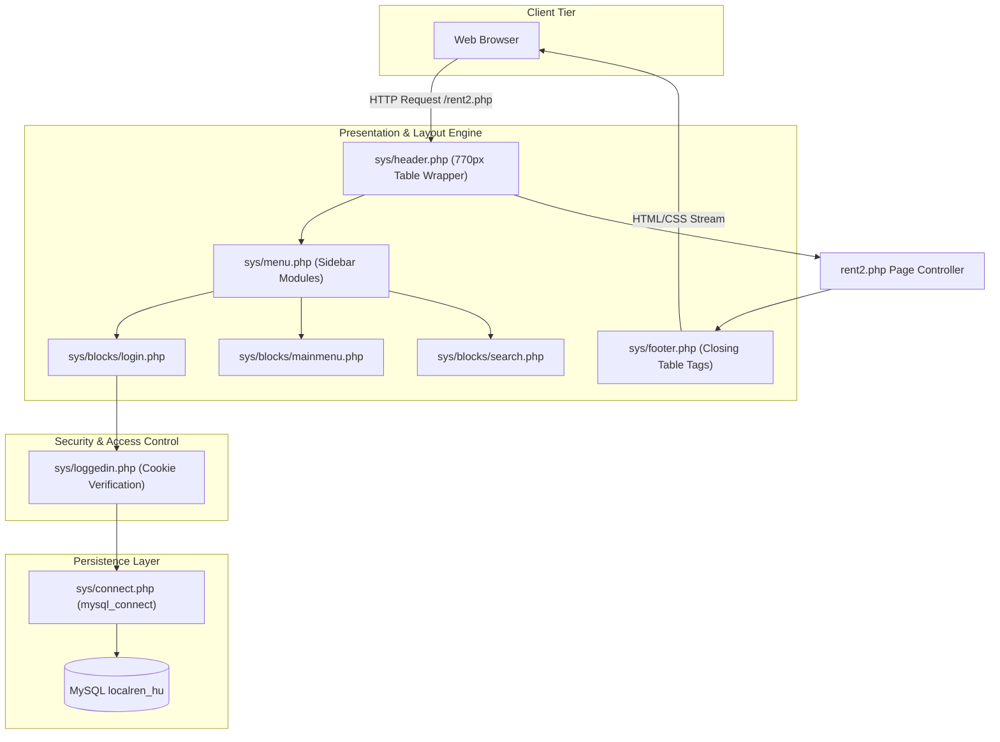
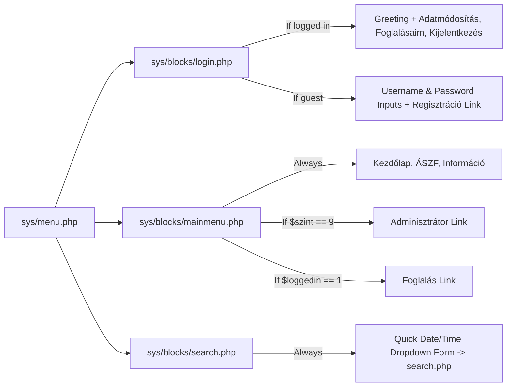

# System Architecture & Request Lifecycle

> **Module**: Architecture Specification  
> **Source Directory**: `app/v3-original_2013/`  
> **Pattern**: Procedural Monolith / Script-per-URL Page Controller

---

## 1. Architectural Philosophy

cRentSys was built prior to the widespread adoption of modern MVC frameworks in PHP (such as Laravel or Symfony). It adheres to a **Page Controller Monolith** pattern where every functional endpoint corresponds to an isolated `.php` file in the webroot or administrative sub-paths.



---

## 2. Global Layout & Templating Pipeline

All user-facing and administrative pages follow a strict layout inclusion structure centered around an HTML table with a fixed width of **770 pixels**.

### Inclusion Sequence:
1. **`sys/header.php`**:
   - Sends HTML document headers (`<!DOCTYPE HTML>`).
   - Sets document title: `LocalRent On-Line Foglalási Rendszer`.
   - Injects charset meta tag: `<META http-equiv="Content-Type" content="text/html; charset=iso-8859-2">`.
   - Links stylesheet: `<LINK rel="StyleSheet" HREF="style.css" TYPE="text/css">`.
   - Initiates main container table (`<TABLE width="770" height="100%" ...>`).
   - Renders banner image header (`sys/images/head.jpg`).
   - Opens left menu cell (`<TD width="200" class="menu" valign="top">`) and includes `sys/menu.php`.
   - Opens main content cell (`<TD width="570" class="main" valign="top">`).
2. **Page Controller Execution**:
   - The specific requested script (e.g., `rent.php`, `admin_car.php`, `myrent.php`) executes within the 570px content cell.
3. **`sys/footer.php`**:
   - Closes content cell (`</TD>`), table row (`</TR>`), outer table (`</TABLE>`), and document (`</BODY></HTML>`).

---

## 3. Sidebar Assembly Subsystem (`sys/menu.php`)

The sidebar dynamically orchestrates three independent procedural blocks:



---

## 4. Execution & State Lifecycle

```
[ HTTP GET/POST Request ]
         │
         ▼
[ Web Server (Apache) maps to script.php ]
         │
         ▼
[ script.php includes sys/header.php ]
         │
         ▼
[ sys/header.php includes sys/menu.php ]
         │
         ▼
[ sys/blocks/login.php includes sys/loggedin.php ]
         │
         ▼
[ sys/loggedin.php includes sys/connect.php ]
         │
         ▼
[ sys/connect.php executes mysql_connect() & mysql_select_db() ]
         │
         ▼
[ sys/loggedin.php iterates v3_user against $_COOKIE['usernev'] & $_COOKIE['pass'] ]
         │
         ├──> Sets $loggedin = 1, $loggedlevel = row['szint'], $ulogged = row['uid']
         │
         ▼
[ Navigation blocks rendered based on $loggedlevel ]
         │
         ▼
[ script.php executes business logic & SQL queries ]
         │
         ▼
[ script.php includes sys/footer.php & flushes HTML stream ]
```

---

## 5. Rich Client Integration (`wz_tooltip.js`)

For administrative dispatchers, `admin_calendar.php` and `admin_cal2.php` integrate **Walter Zorn DHTML Tooltip Library** (`wz_tooltip.js` v5.31). Tooltips are dynamically triggered via inline HTML attributes:
```html
<td onmouseover="Tip('<b>Kovács János</b><br>Tel: +36701234567<br>10:00 - 18:00')" onmouseout="UnTip()">
```
This enables instantaneous reservation inspection without requiring AJAX, asynchronous fetch, or page reloads.
