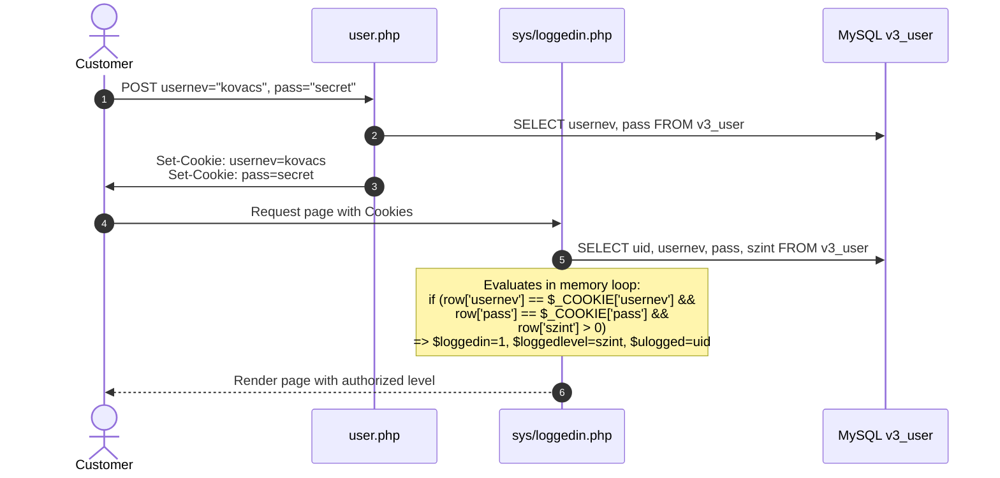

# Authentication & Session Architecture

> **Module**: Identity, Session Management & Access Control  
> **Source Scripts**: `sys/loggedin.php`, `user.php`, `logout.php`, `sys/blocks/login.php`

---

## 1. Cookie-Based Session Mechanism

cRentSys does not use PHP server-side sessions (`$_SESSION`). Instead, identity is maintained entirely through browser cookies:



---

## 2. In-Memory Verification Routine (`sys/loggedin.php`)

```php
<?php
  $loggedin = 0;
  $loggedlevel = 0;
  include ("sys/connect.php");

  $result = mysql_query ("SELECT v3_user.uid, v3_user.usernev, v3_user.pass, v3_user.szint
                          FROM v3_user
                         ") or die (mysql_error ());

  while($row = mysql_fetch_array($result)){
    if ($row['usernev'] == $_COOKIE['usernev'] AND $row['pass'] == $_COOKIE['pass'] AND $row['szint'] > 0) {
      $loggedin = 1;
      $loggedlevel = $row['szint'];
      $ulogged = $row['uid'];
    }
  }
?>
```

### Global Variables Instantiated:
- `$loggedin`: Boolean flag (`1` if valid credentials found, `0` otherwise).
- `$loggedlevel`: Integer permission level (`1` for customer, `9` for admin).
- `$ulogged`: Integer ID of the authenticated user (`v3_user.uid`).

---

## 3. Session Teardown (`logout.php`)

When the user clicks **Kijelentkezés**, `logout.php` invalidates the cookies by sending empty values:
```php
<?php
  SetCookie ("usernev", "");
  SetCookie ("pass", "");
  include ("sys/header.php");
  echo '<center>Sikeresen kijelentkezett!</center>';
  include ("sys/footer.php");
?>
```
