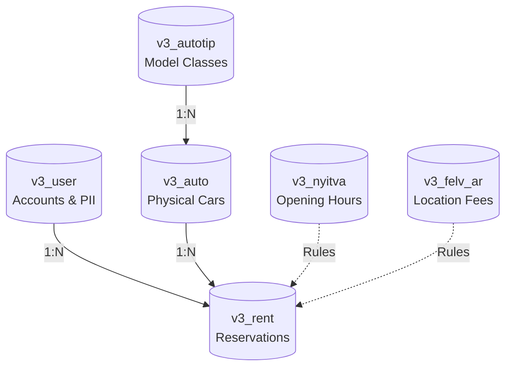

# Database Architecture & Storage Engine Specifications

> **Module**: Database Architecture  
> **Database Name**: `localren_hu`  
> **Storage Engine**: MySQL MyISAM (Compatible with InnoDB)  
> **Character Encoding**: `latin2` (ISO-8859-2 Central European)

---

## 1. Storage Engine & Table Overview

cRentSys relies on **6 relational tables**:



| Table Name | Storage Engine | Row Format | Primary Responsibility |
| :--- | :---: | :---: | :--- |
| **`v3_user`** | `MyISAM` | Dynamic | Customer profiles, authentication credentials, and identity documents. |
| **`v3_autotip`** | `MyISAM` | Dynamic | Vehicle model specifications, daily prices, deposit notes, and images. |
| **`v3_auto`** | `MyISAM` | Dynamic | Physical car units with license plates, VINs, engine #, and codes. |
| **`v3_rent`** | `MyISAM` | Dynamic | Reservation bookings, timestamps, locations, and pricing breakdowns. |
| **`v3_nyitva`** | `MyISAM` | Fixed | Weekly opening hours matrix (1=Monday to 7=Sunday). |
| **`v3_felv_ar`** | `MyISAM` | Fixed | Location delivery fees for regular hours (`1`) vs out-of-hours (`0`). |

---

## 2. Character Set & Collation Architecture

- **Database Encoding**: `latin2` (`ISO-8859-2`).
- **Collation**: `latin2_hungarian_ci` or `latin2_general_ci`.
- **Hungarian Diacritics Handled**: `á`, `é`, `í`, `ó`, `ö`, `ő`, `ú`, `ü`, `ű` (and uppercase equivalents).

> [!WARNING]
> When migrating to MySQL 8.0 or modern stacks, all tables and text columns must be converted to `utf8mb4` (`utf8mb4_unicode_ci`) to prevent mojibake corruption.

---

## 3. Query Execution & Connection Flow

Database connection is instantiated per-request in `sys/connect.php`:
```php
mysql_connect ("localhost", "localren", "tnerLACOL8002") or die (mysql_error());
mysql_select_db ("localren_hu") or die (mysql_error());
```
- Non-pooled, non-persistent connection lifecycle.
- Connections automatically terminate upon script execution completion.
