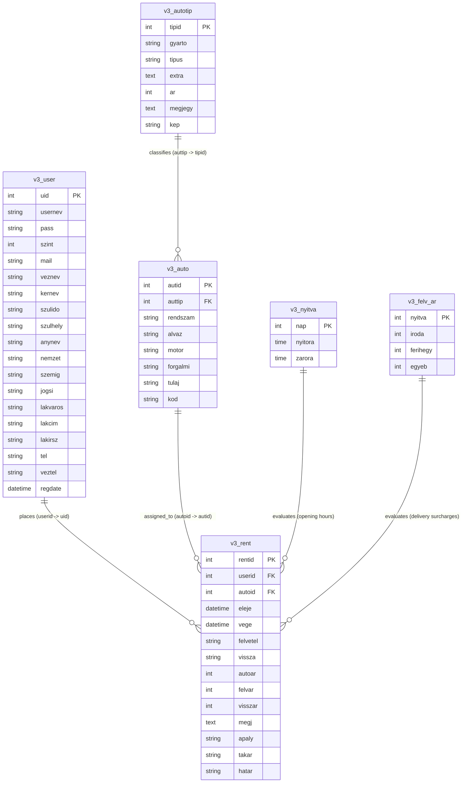

# Data Models, Entity Relationships & DDL Specifications

> **Module**: Data Model & Entity Specifications  
> **Source Schema**: `localren_hu`

---

## 1. Entity-Relationship Model (ERD)

---

## 2. Table Data Dictionaries

### 2.1 `v3_user` (Accounts & Customers)
| Column | Type | Nullable | Key | Description |
| :--- | :--- | :---: | :---: | :--- |
| `uid` | `INT(11)` | NO | PK (AI) | Internal user identifier. |
| `usernev` | `VARCHAR(50)` | NO | MUL | Unique login handle. |
| `pass` | `VARCHAR(50)` | NO | | Plaintext password. |
| `szint` | `INT(2)` | NO | | Role level (`0`=Banned, `1`=Customer, `9`=Admin). |
| `mail` | `VARCHAR(100)` | NO | | Contact & confirmation email address. |
| `veznev` | `VARCHAR(50)` | NO | | Family name (Vezetéknév). |
| `kernev` | `VARCHAR(50)` | NO | | Given name (Keresztnév). |
| `szulido` | `VARCHAR(20)` | YES | | Birth date (`YYYY-MM-DD`). |
| `szulhely` | `VARCHAR(50)` | YES | | Birth place city. |
| `anynev` | `VARCHAR(50)` | YES | | Mother's maiden name. |
| `nemzet` | `VARCHAR(50)` | YES | | Nationality (default: `Magyar`). |
| `szemig` | `VARCHAR(30)` | YES | | National ID or Passport document number. |
| `jogsi` | `VARCHAR(30)` | YES | | Driver's license number. |
| `lakvaros` | `VARCHAR(50)` | YES | | City of residence. |
| `lakcim` | `VARCHAR(100)` | YES | | Street, house, and apartment address. |
| `lakirsz` | `VARCHAR(10)` | YES | | Postal ZIP code. |
| `tel` | `VARCHAR(30)` | NO | | Primary mobile telephone number. |
| `veztel` | `VARCHAR(30)` | YES | | Secondary / landline telephone number. |
| `regdate` | `DATETIME` | YES | | Registration timestamp. |

---

### 2.2 `v3_autotip` (Car Model Categories)
| Column | Type | Nullable | Key | Description |
| :--- | :--- | :---: | :---: | :--- |
| `tipid` | `INT(11)` | NO | PK (AI) | Category identifier. |
| `gyarto` | `VARCHAR(50)` | NO | | Make/Manufacturer (e.g. `Suzuki`, `Skoda`). |
| `tipus` | `VARCHAR(50)` | NO | | Model name (e.g. `Swift 1.3`, `Octavia Combi`). |
| `extra` | `TEXT` | YES | | Vehicle features (AC, doors, transmission). |
| `ar` | `INT(11)` | NO | | 24-hour base rental rate in HUF. |
| `megjegy` | `TEXT` | YES | | Deposit terms (e.g. `50.000 Ft kaució`). |
| `kep` | `VARCHAR(100)` | YES | | Image filename in `photos/`. |

---

### 2.3 `v3_auto` (Physical Fleet Inventory)
| Column | Type | Nullable | Key | Description |
| :--- | :--- | :---: | :---: | :--- |
| `autid` | `INT(11)` | NO | PK (AI) | Physical car identifier. |
| `auttip` | `INT(11)` | NO | FK | References `v3_autotip.tipid`. |
| `rendszam` | `VARCHAR(15)` | NO | | License plate number (e.g. `JHG-412`). |
| `alvaz` | `VARCHAR(50)` | YES | | Chassis / VIN number. |
| `motor` | `VARCHAR(50)` | YES | | Engine serial number. |
| `forgalmi` | `VARCHAR(50)` | YES | | Vehicle registration cert booklet number. |
| `tulaj` | `VARCHAR(100)` | YES | | Legal owner / leasing partner entity. |
| `kod` | `VARCHAR(20)` | NO | | Dispatch code (e.g. `SW-01`). |

---

### 2.4 `v3_rent` (Rental Bookings)
| Column | Type | Nullable | Key | Description |
| :--- | :--- | :---: | :---: | :--- |
| `rentid` | `INT(11)` | NO | PK (AI) | Reservation identifier. |
| `userid` | `INT(11)` | NO | FK | References `v3_user.uid`. |
| `autoid` | `INT(11)` | NO | FK | References `v3_auto.autid`. |
| `eleje` | `DATETIME` | NO | MUL | Start datetime (`YYYY-MM-DD HH:MM:SS`). |
| `vege` | `DATETIME` | NO | MUL | End datetime (`YYYY-MM-DD HH:MM:SS`). |
| `felvetel` | `VARCHAR(100)` | NO | | Pickup location descriptor. |
| `vissza` | `VARCHAR(100)` | NO | | Return location descriptor. |
| `autoar` | `INT(11)` | NO | | Base vehicle rental price (HUF). |
| `felvar` | `INT(11)` | NO | | Pickup delivery fee / surcharge (HUF). |
| `visszar` | `INT(11)` | NO | | Return delivery fee / surcharge (HUF). |
| `megj` | `TEXT` | YES | | Customer notes / requests. |
| `apaly` | `VARCHAR(10)` | YES | | Motorway vignette option (`igen`/`nem`). |
| `takar` | `VARCHAR(10)` | YES | | Cleaning service option (`igen`/`nem`). |
| `hatar` | `VARCHAR(10)` | YES | | Cross-border permit option (`igen`/`nem`). |

---

### 2.5 `v3_nyitva` (Operating Schedule)
| Column | Type | Nullable | Key | Description |
| :--- | :--- | :---: | :---: | :--- |
| `nap` | `INT(2)` | NO | PK | Day of week (`1`=Monday ... `7`=Sunday). |
| `nyitora` | `TIME` | NO | | Opening hour (`HH:MM:SS`). |
| `zarora` | `TIME` | NO | | Closing hour (`HH:MM:SS`). |

---

### 2.6 `v3_felv_ar` (Delivery Surcharges)
| Column | Type | Nullable | Key | Description |
| :--- | :--- | :---: | :---: | :--- |
| `nyitva` | `INT(2)` | NO | PK | `1` = Normal hours, `0` = Out of hours. |
| `iroda` | `INT(11)` | NO | | Office delivery surcharge (HUF). |
| `ferihegy` | `INT(11)` | NO | | Airport delivery surcharge (HUF). |
| `egyeb` | `INT(11)` | NO | | Custom address surcharge (HUF). |
