# Functional Capabilities & Feature Matrix

> **Module**: Complete Feature Specification  
> **Target Audience**: Product Managers, Operations Teams, Developers

---

## 1. Comprehensive Feature Matrix

```mermaid
graph TD
    Features[cRentSys Features] --> Cust[Customer Features]
    Features --> Admin[Admin & Dispatcher Features]
    Features --> Biz[Business & Legal Engine]

    Cust --> C1[User Registration & Profile Update]
    Cust --> C2[Real-Time Availability Search]
    Cust --> C3[5-Step Guided Booking Wizard]
    Cust --> C4[Automated HTML Confirmation Email]
    Cust --> C5[My Bookings Dashboard]
    Cust --> C6[Direct RTF Contract Download]

    Admin --> A1[Vehicle Model Catalog Management]
    Admin --> A2[Physical Fleet Unit Inventory CRUD]
    Admin --> A3[Interactive Monthly Grid Calendar with wz_tooltip]
    Admin --> A4[Daily Handover Dispatch Schedule]
    Admin --> A5[Reservation Editing & Cancellation]
    Admin --> A6[Customer CRM & User Role Management]
    Admin --> A7[Revenue Auditing & Investor Profit Split]

    Biz --> B1[24-Hour Rental Day Ceiling Calculation]
    Biz --> B2[Out-of-Hours Surcharge Evaluation]
    Biz --> B3[Delivery Location Matrix Pricing]
    Biz --> B4[CASCO / KGFB Insurance Contract Generator]
```

---

## 2. Customer Portal Features

### 2.1 Registration & Profile Self-Service (`register.php`, `register_mod.php`)
- Captures full legal credentials, contact information, identity numbers (National ID/Passport, Driver's License, Mother's maiden name), and residential address.
- Allows authenticated customers to update contact and license parameters at any time.

### 2.2 Vehicle Search & Real-Time Availability Engine (`search.php`)
- Evaluates fleet occupancy across exact requested timestamps.
- Returns only non-conflicting vehicles with thumbnail images, specification lists, and exact calculated pricing.

### 2.3 5-Step Booking Funnel (`rent.php` to `rent5.php`)
- **Step 1**: Date & time range selection.
- **Step 2**: Available vehicle catalog & daily rate calculation.
- **Step 3**: Handover and return location selection with automated out-of-hours surcharge evaluation.
- **Step 4**: Optional add-ons (Highway vignette, GPS, cleaning, cross-border permit) and transparent cost summary.
- **Step 5**: Database persistence, instant screen confirmation, and dual HTML email dispatch.

### 2.4 Customer Dashboard & Dynamic Contract Generation (`myrent.php`, `contractor.php`)
- Centralized history of all active, upcoming, and past reservations.
- Single-click generation of legally binding Microsoft Word compatible RTF agreements (`szerzodes.rtf`).

---

## 3. Administrative & Dispatcher Features

### 3.1 Fleet & Model CRUD (`admin_car.php`, `admin_cartyp*.php`, `admin_car*.php`)
- Grouped vehicle catalog view by price category.
- Form management for model specifications (features, daily rate, deposit amount, photo upload).
- Asset management for individual cars (VIN, engine number, license plate, registration certificate doc #, lessor entity, dispatch code).

### 3.2 Visual Dispatch Calendars (`admin_calendar.php`, `admin_cal2.php`, `admin_calday.php`)
- **Monthly Matrix**: Full-month calendar grid plotting vehicles on Y-axis and days (1..31) on X-axis. Hovering over booked blocks displays renter name, phone number, and times via `wz_tooltip.js`.
- **Daily Handover Log**: Detailed daily schedule listing vehicle handovers and returns.

### 3.3 Financial Turnover & Investor Accounting (`admin_allincome.php`, `admin_carincome.php`)
- Monthly revenue reports itemizing net/gross vehicle rental fees and delivery fees.
- 50% revenue share accounting for third-party vehicle investors.
- Single-vehicle utilization and ROI tracking.
