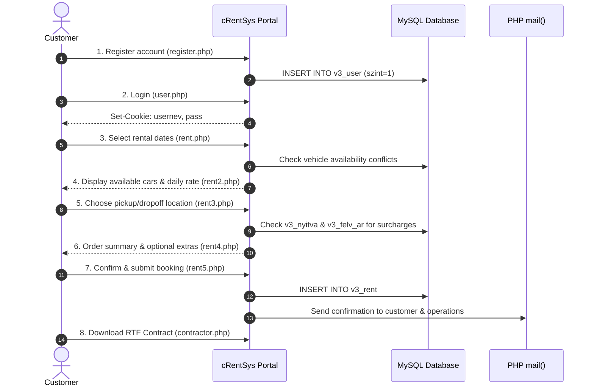

# Getting Started Guide

> **Module**: Onboarding & Operational Quickstart  
> **Audience**: Developers, System Administrators, Rental Dispatchers

---

## 1. Quick Developer Onboarding

### Repository Structure At-A-Glance
```
cRentSys-base/
├── app/
│   └── v3-original_2013/      # Complete PHP 5 application source code
│       ├── sys/               # Shared layout, header, footer, DB connection, auth
│       │   └── blocks/        # Sidebar modules (login, menu, search)
│       ├── photos/            # Vehicle fleet imagery and thumbnails
│       ├── *.php              # Public controllers & administrative controllers
│       └── style.css          # Core stylesheet
└── docs/
    └── v3-original/
        └── core/              # Authoritative 20-part core technical documentation
```

### Essential Files for Developers:
* **Database Connection**: [`app/v3-original_2013/sys/connect.php`](file:///home/w7-loqker/w7-workspace/selfbase/w7-mgfcode/repos/cRentSys-base/app/v3-original_2013/sys/connect.php)
* **Authentication Logic**: [`app/v3-original_2013/sys/loggedin.php`](file:///home/w7-loqker/w7-workspace/selfbase/w7-mgfcode/repos/cRentSys-base/app/v3-original_2013/sys/loggedin.php)
* **Booking Wizard Pipeline**: `rent.php` $
ightarrow$ `rent2.php` $
ightarrow$ `rent3.php` $
ightarrow$ `rent4.php` $
ightarrow$ `rent5.php`
* **Admin Dashboard Entry**: [`app/v3-original_2013/admin.php`](file:///home/w7-loqker/w7-workspace/selfbase/w7-mgfcode/repos/cRentSys-base/app/v3-original_2013/admin.php)

---

## 2. Customer Rental Workflow Tour



---

## 3. Dispatcher Operations Quickstart

Dispatchers holding `szint == 9` credentials access the operations hub at `admin.php`:

1. **Morning Fleet Check**: Open `admin_calday.php` to inspect all scheduled handovers and returns for today.
2. **Monthly Planning**: Open `admin_calendar.php` to view the full monthly vehicle matrix. Hover over occupied blocks to view customer contact information.
3. **Adding a Vehicle**:
   - Create the model class in `admin_cartypnew.php` (set name, features, daily rate, upload photo).
   - Register the physical car unit in `admin_carnew.php` (license plate, VIN, engine number, code).
4. **Modifying a Reservation**: Open `admin_caldetails.php` for the vehicle, locate the booking, and click **Módosítás** to access `admin_rentedit.php`.
5. **End-of-Month Accounting**: Navigate to `admin_allincome.php`, select year and month, and review the gross/net revenue breakdown and 50% investor share totals.
