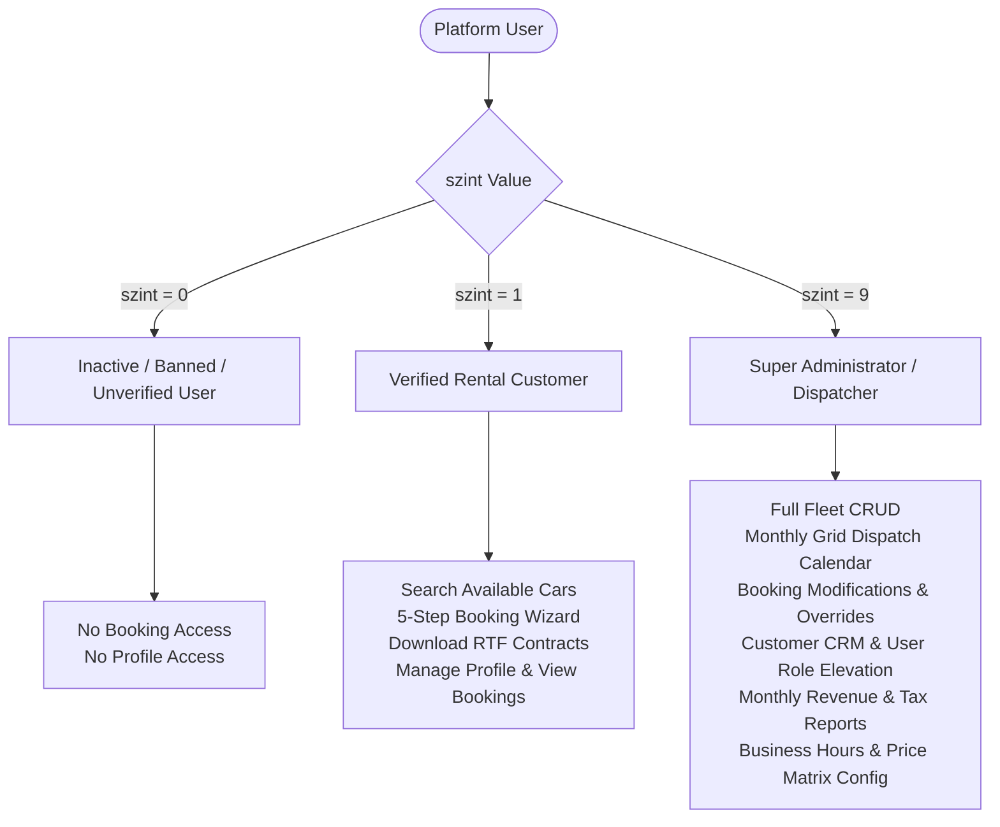

# Business Domain Overview & System Taxonomy

> **Module**: Domain Analysis & Taxonomy  
> **Target Organization**: EURO Brill Kft. (LocalRent / CentRent)  
> **Geographic & Legal Scope**: Budapest, Hungary

---

## 1. Business Context & Operating Model

**cRentSys** was custom-engineered to automate the operational workflows of **LocalRent** (operated by *EURO Brill Kft.*, based at 1037 Budapest, Bojtár u. 9). The business model encompasses:
1. **Short-Term & Long-Term Passenger Car Rentals**: Offering compact and mid-size fleet vehicles (e.g., Suzuki Swift, Suzuki SX4, Skoda Octavia, Skoda Rapid).
2. **Third-Party Fleet Investor Partnerships**: Integrating vehicles owned by independent contractors/investors, managing revenue sharing with a 50% net split.
3. **Flexible Delivery Logistics**: Delivering and picking up vehicles at the central office, Budapest Liszt Ferenc International Airport (Ferihegy), or custom residential/hotel addresses.
4. **Out-of-Hours Service**: Automated surcharge pricing for handovers taking place outside published opening hours.

---

## 2. User Taxonomy & Access Control Matrix

The platform organizes actors into three distinct privilege tiers defined in `v3_user.szint`:

### Authorization Tier Specifications:

| Access Level | Role Identifier | Permissions & Capabilities |
| :---: | :--- | :--- |
| **`0`** | **Inactive / Banned** | Cannot authenticate; session rejected by `sys/loggedin.php`. |
| **`1`** | **Registered Customer** | Can search available inventory, initiate and commit 5-stage bookings, view personal rental history in `myrent.php`, download RTF contract agreements via `contractor.php`, and update profile data in `register_mod.php`. |
| **`9`** | **Super Administrator** | Unrestricted access to `admin.php` and all 34 `admin_*.php` modules. Can create/edit/delete car models, manage physical car assets, edit/cancel bookings, adjust delivery pricing, configure weekly opening schedules, access customer dossiers, and generate financial revenue audits. |

---

## 3. Hungarian Automotive Rental Legal & Operational Framework

The system incorporates specific Hungarian statutory and commercial requirements:
- **Identity Verification**: Requires full legal name (`veznev`, `kernev`), mother's maiden name (`anynev`), birth place and date (`szulhely`, `szulido`), National ID card number (`szemig`), and Driver's license number (`jogsi`).
- **Mandatory Insurance Standards**: Enforces Third-Party Liability (*KGFB*) and Comprehensive Collision Damage Waiver (*CASCO*) with an explicit **10% (minimum 100,000 HUF)** deductible.
- **Value-Added Tax (ÁFA)**: Encodes the historic Hungarian 20% VAT rate (calculated as $	ext{Gross} = 	ext{Net} 	imes rac{6}{5}$).
- **Motorway Electronic Tolls (*Matrica*)**: Tracks electronic highway toll vignette authorization (`apaly`).
- **Cross-Border Travel (*Határátlépés*)**: Tracks international travel permits for cross-border transit into neighboring European Union jurisdictions (`hatar`).
