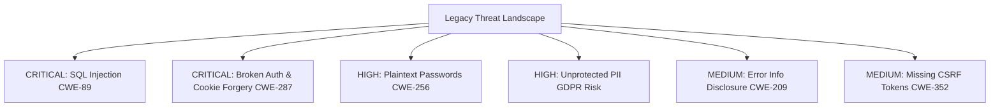

# Security Audit, Threat Model & Vulnerability Assessment

> **Module**: Security Review & Risk Analysis  
> **Classification**: Critical Technical Debt & Vulnerability Assessment

---

## 1. Vulnerability Findings Summary



| ID | Vulnerability | Severity | Impact | Remediation |
| :--- | :--- | :---: | :--- | :--- |
| **SEC-01** | SQL Injection | **CRITICAL** | Direct variable concatenation in queries allows full DB dump, modification, and table drops. | Migrate to PDO with parameterized prepared statements. |
| **SEC-02** | Broken Auth / Forgery | **CRITICAL** | Cookies contain raw credentials. Attackers can forge `$_COOKIE['usernev']` and `pass` to gain admin level 9. | Implement server-side sessions, JWT, and encrypted session tokens. |
| **SEC-03** | Plaintext Passwords | **HIGH** | User passwords stored unhashed in `v3_user.pass`. | Implement `password_hash()` with Argon2id or Bcrypt. |
| **SEC-04** | PII / Privacy Leak | **HIGH** | Driver's licenses, national IDs, and mother's maiden names stored unencrypted. | Field-level encryption for sensitive PII; enforce GDPR retention rules. |
| **SEC-05** | Info Disclosure | **MEDIUM** | `or die(mysql_error())` displays full SQL syntax and internal schema to clients. | Implement centralized exception handling and generic error pages. |
| **SEC-06** | Missing Anti-CSRF | **MEDIUM** | State-changing POST forms lack CSRF tokens. | Enforce Anti-CSRF tokens across all form submissions. |

---

## 2. Detailed Vulnerability Analysis

### 2.1 SQL Injection Exploitation Scenarios
In `admin_cardel2.php`:
```php
$carid = $_GET['carid'];
mysql_query ("DELETE FROM v3_auto WHERE autid='$carid'");
```
**Exploit**: Calling `admin_cardel2.php?carid=1' OR '1'='1` evaluates to `DELETE FROM v3_auto WHERE autid='1' OR '1'='1'`, which purges all physical vehicles from the fleet database.

### 2.2 Cookie Forgery Exploitation
Because `sys/loggedin.php` checks raw cookie values against `v3_user`, an attacker who discovers an administrator username and password can simply set browser cookies via JavaScript or DevTools:
```javascript
document.cookie = "usernev=admin; path=/";
document.cookie = "pass=admin123; path=/";
```
Upon refreshing the page, the attacker is immediately granted `$loggedlevel = 9` access.
