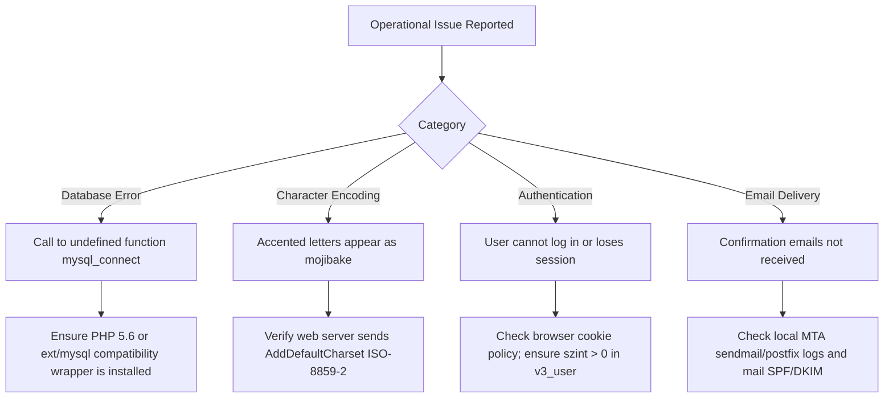

# Diagnostic & Troubleshooting Guide

> **Module**: Operational Diagnostics & Remediation  
> **Audience**: Support Engineers, System Administrators

---

## 1. Diagnostic Decision Tree



---

## 2. Common Errors & Resolution Steps

### Issue 1: `Fatal error: Call to undefined function mysql_connect()`
- **Root Cause**: Running on PHP 7.0+ where `ext/mysql` has been removed.
- **Resolution**:
  1. Deploy using the containerized PHP 5.6 Docker image, or
  2. Implement a `mysql_*` compatibility shim wrapping `PDO_MySQL` or `mysqli`.

### Issue 2: Hungarian Diacritics Appear Corrupted (`õ`, `û` instead of `ő`, `ű`)
- **Root Cause**: Web server default charset is emitting `UTF-8` while the application files are encoded in `ISO-8859-2`.
- **Resolution**: Add `AddDefaultCharset ISO-8859-2` in Apache VirtualHost configuration or `.htaccess`.

### Issue 3: Customer Cannot Log In After Registration
- **Root Cause**: The user's `szint` column in `v3_user` was initialized to `0` instead of `1`.
- **Resolution**: Verify `v3_user.szint` value. If `0`, execute:
  ```sql
  UPDATE v3_user SET szint = 1 WHERE usernev = 'username';
  ```
