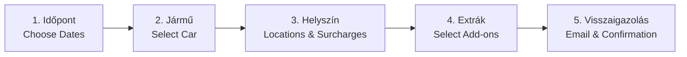

# End-User Customer Manual

> **Module**: Customer Operations Guide  
> **Audience**: Registered Customers & Prospective Renters

---

## 1. Creating an Account & Logging In

### Registration Steps:
1. On any page, navigate to the left sidebar and click **Regisztráció** (or visit `register.php`).
2. Fill in all required identity fields:
   - **Login Credentials**: Desired username and password (entered twice for verification).
   - **Personal Details**: Last name (*Vezetéknév*), First name (*Keresztnév*), Mother's maiden name (*Anyja neve*), Birth place and birth date.
   - **Official Documents**: National ID card or Passport number (*Szem. ig. szám*), Driver's license number (*Jogosítvány szám*).
   - **Address**: Postal code, City, and Street address.
   - **Contact**: Mobile telephone number (*Mobiltelefonszám*) and Email address.
3. Click **OK** to save. The system will confirm your registration.

### Logging In:
1. Enter your username and password into the **Belépés** panel on the left sidebar.
2. Click **OK**. Upon successful authentication, your name will appear with links to **Adatmódosítás** (Edit Profile), **Foglalásaim** (My Bookings), and **Kijelentkezés** (Logout).

---

## 2. Booking a Vehicle (5-Step Walkthrough)

### Step 1: Choose Dates & Times (`rent.php`)
- Select your pickup date/hour/minute and return date/hour/minute.
- Click **Tovább** to query available cars.

### Step 2: Select Available Vehicle (`rent2.php`)
- Browse available vehicles. Each listing shows the manufacturer, model, features (e.g., AC, manual/automatic), deposit notes, total rental days, and calculated price.
- Click the **Foglalás** button next to your chosen car.

### Step 3: Select Pickup & Return Locations (`rent3.php`)
- Choose your handover point: **Központi iroda** (Central Office), **Ferihegy Repülőtér** (Airport), or **Egyéb cím** (Custom Budapest Address).
- If your pickup or return falls outside standard operating hours, the system will automatically display the corresponding out-of-hours fee.

### Step 4: Choose Optional Extras (`rent4.php`)
- Review your order summary.
- Optionally select add-ons:
  - **Autópálya-használat** (Highway vignette permit)
  - **Határátlépés** (Cross-border travel authorization)
  - **Használat utáni takarítás** (Post-rental cleaning service: +2,500 HUF)
  - **GPS navigáció** (GPS navigation unit: +500 HUF / day)
- Enter any special requests or flight numbers into the **Megjegyzés** box.

### Step 5: Final Confirmation & Email (`rent5.php`)
- Click **Megrendelés** to finalize your booking.
- You will receive an immediate confirmation email containing an itemized price breakdown, contact numbers, and a checklist of original identification documents required upon vehicle handover.

---

## 3. Managing Bookings & Downloading Contracts (`myrent.php`)

1. Click **Foglalásaim** in the left sidebar menu.
2. View your active, upcoming, and past rentals.
3. Click **Szerződés (RTF)** next to any reservation to instantly download your formal rental agreement (`szerzodes.rtf`), ready to print or open in Microsoft Word.
